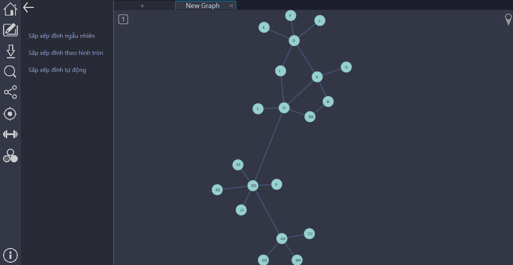

# GRAPH SIMULATION USING JAVAFX


This is a second year OOP Lab project. Visualizes the following algorithms on graphs input by the user on an interactive canvas.

## Installation

Run nhom2.window.Main by using Java IDE.

```bash
Main.java
```

## Usage :

### Vertex Placement Mode:
1. Placement randomly
2. Placement circularly
3. Placement using force-directed algorithm in real-time

### Algorithm Available
1. Path Finding
2. Auto Path Finding
3. BFS
4. DFS
5. Dijkstra
6. Kruskal's MST
7. Coloring Graph

## Team information

Nhom 2 (Group 2) in class OOP - 124158 at HUST.

